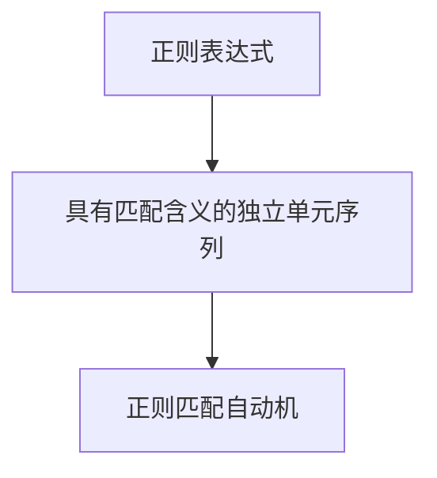

> 大家好，我是寒草😈，一只草系码猿🐒。间歇性热血🔥，持续性沙雕🌟。  
> 如果喜欢我的文章，可以关注➕ 点赞 👍，，与我一同成长吧～  
> 微信：hancao97

# 序章
## 对读者的话
前一阵，我发了一篇文章[前端学编译原理（一）：编译引论](https://juejin.cn/post/6974203096679317535)，粗略的介绍了一下`编译原理`这门学科，我也想到一个问题：
> 单纯枯燥的讲解编译原理这门课程大家可能并不会很接受这系列文章，并且单纯的讲解编译原理肯定有很多人比我讲的要好要细致。  

**所以我做了这样一个决定**：我是一个前端，读我文章的大多数人可能也是前端，所以我不妨接下来将前端的一些应用或者实践和编译原理结合起来。所以这篇文章是本系列的全新实践🌟，如果大家喜欢可以留下你们的点赞👍 或者关注➕，你们的支持是我更文的最大动力🔥。

本篇文章，我将从自动机出发，扩展到我们常用的正则匹配，最后我也会带着大家`亲手实现一个简单的正则匹配`。干货满满，也会有一己之言，如果大家有疑问或者指正请留在评论区，我会仔细阅读。  

> 仓库地址：[js-regular](https://github.com/CodingCommunism/js-regular)，照例放出仓库的地址，请各位大佬忽视我没写`gitignore`不小心把`node_modules`上传上来了，失误，纯属失误

## 文章大纲
- `有限自动机基础：DFA与NFA`
- `正则原理浅析`
- `手摸手，带你实现简易版正则引擎`
和文章目录一致，其中如果不阅读第一章自动机科普，也可以直接跳转到第二章开始阅读，但是推荐全文阅读， 因为第一章也干货满满， 第一章过于生硬的地方我也有举例说明或者用更加接地气的手段做了描述总结✨，以获得完整的思考体验，感受一遍我完整学习实践的过程，属于正则的那如烟火🔥 般绚烂的夏日诗篇也会徐徐展开。

**那么我们咸盐少许（闲言少叙），开始我们的正篇吧～**

# 有限自动机基础

## 章节引论—有限自动机（FA）

> tip: 如果看不懂特点和形式定义中的话，请大家移步后面`我来总结一下`部分，帮助大家对有限自动机的定义有一个粗略的理解。

首先在开始下面的话题之前，我们有必要去了解一下，什么是有限自动机， 有限自动机也被称为：`时序机`。

**有限自动机有以下特点**：

- 系统具有有限个状态，不同的状态代表不同的意义。按照实际的需要，系统可以在不同的状态下完成规定的任务。

- 我们可以将输入字符串中出现的字符汇集在一起构成一个字母表。系统处理的所有字符串都是这个字母表上的字符串。

- 系统在任何一个状态下，从输入字符串中读入一个字符，根据当前状态和读入的这个字符转到新的状态。

- 系统中有一个状态，它是系统的开始状态。

- 系统中还有一些状态表示它到目前为止所读入的字符构成的字符串是语言的一个句子。

**有限自动机的形式定义**：

有限状态自动机是一个五元组 `M=(Q, Σ, δ, q0, F)`，其中：

- Q——状态的非空有穷集合。∀q∈Q，q称为M的一个状态。

- Σ——输入字母表。

- δ —— 状态转移函数，有时又叫作状态转换函数或者移动函数，δ：Q×Σ→Q，δ(q,a)=p。

- q0 —— M的开始状态，也可叫作初始状态或启动状态。q0∈Q。

- F —— M的终止状态集合。F被Q包含。任给q∈F，q称为M的终止状态

**我来总结一下**：

大家不要被上面列出的一大堆定义和特点绕晕，其实总结起来非常简单：
- 首先有限状态机有一个开始状态，具一个不太恰当的例子：比如说你要提交一个工单，你会经历直属领导审批，人事审批，老总审批几个阶段。那么`提交工单`就是这个工单系统的有限自动机的开始状态，对应五元组里面的`q0`
- 当然，除了开始状态我们还有一个结束状态，那么对于我们提交工单这个流程来讲，我们的结束状态就是`工单成功`或者`工单结束`，大家可以发现这个有限自动机具有两个终止状态，所以终止状态是一个集合，并不一定只有一个结束状态，这个结束状态就是五元组里面的`F`
- 还有我们有限自动机有限两个字很重要，有限指的是具有有限个状态，就像我们下图中的`提交工单`,`待上级领导审批`，`待人事审批`，`待老总审批`， `工单成功`， `工单失败`就是我们的状态集，即五元组中的`Q`
- 那么作为自动机，我们该怎么知道我们的下一个状态是啥呢，所以其实我们需要两个东西，一个是现在的状态，一个是状态转移函数δ，比如：我们现在的阶段是人事审批，我们的输入其实就是人事审批，经过`状态转移函数（审批结果判断）`之后我们就可以得到下一步的状态，状态可能是`工单失败`或者`待老总审批`。


不知道经过我的举例之后，大家有没有对定义有了一定的理解，其实总结起来很简单，其实：
> 有限自动机 = 有限的内部状态集合 + 一组控制规则

<!-- more -->

## DFA — 确定有限自动机

### 定义

前文我们已经了解了有限自动机，那么确定有限自动机有哪些特别的点呢，下面我们来看一下`确定有限自动机`的定义：
- 确定有限自动机M为一个五元组 M = ( S, ∑, s0, f, Z)
- S:一个有穷状态集，它的每个元素称为一个状态;
- ∑:一个有穷字母表，它的每个元素称为一个输入字符; 
- s0∈S:唯一的初始状态(开始状态);
- f:状态转换函数:S×∑→ S，且单值函数，f(Si,a)=Sk。`当前状态Si，遇输入字符a时，自动机将唯一地转换到状态 Sk，称Sk为 Si的一个后继状态`;
- Z⊆S:终止状态集(可接受状态集、结束状态集) 其中每个元素称为终止状态(可接受状态、结束状态), Z可空.

我来总结一下：

> 我们其实可以和上面的形式定义做一个比较，我们会发现一些很重要的点：
> 
> - 初始状态唯一
> - 状态转换函数是单值函数
> - 终止状态集Z可以为空

### 举个例子

```js
M=({S,U,V,Q}, {a, b}, f, S, {Q}), 其中f定义为：

f(S, a)=U f(S, b)=V

f(U, a)=Q f(U, b)=V

f(V, a)=U f(V, b)=Q

f(Q, a)=Q f(Q, b)=Q
```

那么我们就可以画出它对应的自动状态机


### DFA接受的字符串
- 对于 ∑ 中任何字符串t，若存在一条从初始结点到某一终止结点 的路径，且这条路上所有弧上的标记符连接成的字符串等于t， 则称 t 可为DFA M所接受

- 若DFA M的初始状态同时又是终止状态，则空字符串可为DFA M所接受.
- DFA M 所能接受的字符串的全体记为L(M)

再次举个例子说明，如果一个自动机是这样的：


那么：L(M1) = { aba, abaa, abab, abaab,...}  
大家有没有发现，正则匹配的雏形已经有了🌟

### DFA的确定性
那么我们为什么说 DFA 是确定有限自动机呢，确定这两个字体现在哪里呢？

- 初始状态唯一
- 状态转换函数f: S×∑→S是一个单值函数，即对任何状态s∈S，输入 符号a∈∑， f(S, a)唯一确定下一状态.

### DFA如何代码实现
比如自动机如图所示：


其实我们想要实现简易的 DFA 自动机可以借助 `swicth case` 实现
```js
// 简单写个switch
switch (currentChar) {
    case 'a':
        goto Lj;
        break;
    case 'b':
        goto Lk;
        break;
    default:
        throw err;
}
```
## NFA — 非确定有限自动机

### 定义
非确定有限自动机M为一个五元组 M = ( S, ∑, S0, f, Z)
- S: 一个有穷状态集，它的每个元素称为一个状态;
- ∑: 一个有穷字母表，它的每个元素称为一个输入字符;
- S0 ⊆ S: 非空初始状态集;
- Z⊆S: 终止状态集;
- f : 状态转换函数，是从S×(∑∪{ε}) 到 S 子集的映射，即S×(∑∪{ε})→ 2^S 
> 注意，这里的后继状态不是单一状态，而是状态集S的子集, 即转换函数不是单值.

我这里总结一下，大家看区别就是`状态转换函数的结果不再是单值`了, `起始状态也这是一个集合`而不是一个确定的值，以及转换函数的的输入是`∑∪{ε}`就表示`有向弧上面的标记可以是空`。

### 举个例子

```js
NFA M = ({0, 1, 2}, {a, b}, f, {0}, {2})
状态转换函数如下：
f(0,a)={0,1} f(1,a)=∅ f(2,a)={2}
f(0,b)={0} f(1,ε)={2} f(2,b)={2}
```
那么我们就可以画出它对应的有限自动机


### NFA接受的字符串
设M是一个NFA，M=(S, ∑, f, S0, Z)，则定义L(M)为从任意初始 状态到任意终止状态所接受的字符串的集合，我们拿上面的自动机举例。
上面自动机接受的字符串集合是：
L(M) = { β | β是形如...a...的由a, b构成的字符串 }  

比如：aaa, bab, abaa...

## DFA 与 NFA 对照

那在本章结束之前，我们回顾一下～  

DFA：
- 开始状态唯一
- 状态转换函数为单值函数

NFA：
- 开始状态是一个状态集合
- 状态转换函数的结果是一个集合
- 有向弧上面的标记可以是空

### 更多扩展内容
> tip: 此处还会很多值得讲的内容，比如 `NFA` 到 `DFA` 的转换, `DFA`的化简等，但是因为文章内容有限，而且与本文主题关系不大，感兴趣的人可以留言，我们继续开坑。当然我也更加鼓励大家自我学习。

# 正则原理浅析

> 本章节部分内容参考：[正则表达式引擎执行原理——从未如此清晰！](https://zhuanlan.zhihu.com/p/107836267)，这篇文章也有很多可以了解的内容大家也可以去围观一下，我从这篇文章学到很多，总结整理的很好。   

前文我们已经讲解过了 DFA 和 NFA，即确定有限自动机和非确定有限自动机，根据前面的铺垫想必各位大佬已经可以将正则引擎与自动机关联起来了，而正则引擎大体也可以分成这样的两大类，即：DFA 正则引擎和 NFA 正则引擎。

## DFA引擎

### 举个例子

我们直接举一个比较简单的例子：

正则表达式是 `a[db]c`   
待匹配的字符串是 `abc`
> 此处我们使用‘[]’的原因是第三章`手摸手，带你实现简易版正则引擎`我们将会去实现‘[]’

下面我们开始匹配：


不知道大家有没有理解，我描述一下对比的过程：
1. 第一次是字符 a 和正则表达式 a 比较
2. 匹配成功后，是字符 b 同时比较表达式中的  b 和 d
3. 再次匹配成功，字符 c 和正则表达式 c 比较
4. 匹配成功

这里面我们值得注意的点是，第二次匹配是 b 同时和 b， d 进行比较，所以可能会消耗更多的内存。

### 特点

我们从上面的例子可以看出一些DFA正则引擎的特点：
- `文本主导`：按照文本顺序执行，所以保证了DFA正则引擎的确定性
- `记录当前所有有效可能`：正如前文示例中的第二次匹配一样，同时比较了 b 和 d ，所以需要消耗更大的内存
- `每个字符只检查一次`：提高了执行效率，因为没有回溯操作重复匹配的过程
- `不能使用反向引用等功能`：因为每个字符只检查一次，只记录当前比较值，所以不能使用反向引用、环视等一些功能

## NFA引擎

### 举个例子

例子还是刚才的例子，方便大家对照：

正则表达式是 `a[db]c`   
待匹配的字符串是 `abc`

下面我们开始匹配：


这里和前面的DFA模式做一下对比，我们会发现区别，NFA引擎在匹配之前会记录字符的位置，然后选择其中一个可能状态进行匹配，如果匹配失败，会进行回溯，进入其他分支进行匹配。

### 特点

我们从上面的例子可以看出一些NFA正则引擎的特点：

- **文表达式主导**：按照表达式的一部分执行，如果不匹配换其他部分继续匹配，直到表达式匹配完成。
- **会记录某个位置**：我们看到当执行到`[db]`时，NFA引擎会记录字符的位置，然后选择其中一个先匹配。
- **单个字符可能检查多次**：我们看到当执行到`[db]`时，比较`d`后发现不匹配，于是NFA引擎换表达式的另一个分支`b`，同时文本位置**回溯**，重新匹配字符'b'。这也是NFA引擎是非确定型的原因，同时带来另一个问题效率可能没有DFA引擎高。
- **可实现反向引用等功能**：因为具有**回溯**这一步，所以可以很容易的实现反向引用等一些功能！

## 对比


## 章节小结
本章结束大家已经获得了所有前置知识🌟，下面我们会利用这些知识去亲手实现一个简单的正则，也是本文的重点，下面我们一起进入下一章的内容吧📖

# 手摸手，带你实现简易版正则引擎
## 章节序言
功能介绍：  
> **入口方法介绍**：我们要提供一个方法，`testReg`，参数有两个，一个是待验证的字符串`str`，另一个是正则表达式`reg`，返回一个`布尔值`，即是否匹配
> 
> **正则表达式规则介绍**：
> - 这个正则表达式要以 `^` 开头，以 `$` 结尾
> - `[]` 表示匹配字符集合中的一个字符，`[]` 后可以接 `*` 或者 `+`
> - `*` 表示匹配 `0` 个或者 `0` 个以上多个 
> - `+` 表示匹配 `1` 个或者 `1` 个以上的多个

```js
// 正则表达式举例
^[123]*mn[ab]+cd$
^a[ab]+$
...
```

仓库地址：[js-regular](https://github.com/CodingCommunism/js-regular) 

## 思路解析

我们遇到一个问题，需要先思考，有了思路之后再进行编码，避免重复修改导致代码的混乱以及时间的浪费。  

那么，我们首先要思考我们的目标是啥，既然我们本篇文章的主题是`自动机`，也没必要卖关子， 我们第一步想到的肯定是， `把正则表达式转换成自动机`， 之后`借助这个正则匹配的自动机去匹配我们的字符串`。

那么我们**如何把一个正则表达式转换成一个自动机**呢？  
我的思路是这样的：


我来简单解读一下，我会把这个问题分成两部分，首先我需要解析字符串，之后转换成具有匹配含义的独立单元序列，即 TOKEN 序列。什么叫做具有匹配含义的独立单元序列呢？  

我举个例子： 

正则表达式是 `^[123]+[a]*3$ `， 那么其它可以分成三个独立单元即：
- `[123]+`
- `[a]*`
- `3`
但是我肯定不会只是拆成三个字符串，我还是会变成三个具有含义的对象(便于生成自动机)，但是这都是后话了。  

之后我们要把 `具有匹配含义的独立单元序列`（我真的是起名鬼才🐶）转换成自动机，既然我们都说了我会用对象表示每个独立单元， 那最简单的方法就是在这个对象中加入 `next` 属性， 当然 `next` 可能是一个数组， 存储着所有可能的分支。

之后我们再写一个方法， 让自动机跑起来就好了。

ok，说干就干，下面我们将进入代码分步骤展示与解读环节，请大家跟着我一起思考。

## 入口方法 - testReg

```js
// the entry function
const testReg = (str, reg) => {
    if (!reg.startsWith('^') || !reg.endsWith('$')){
        // it's not a right reg string
        throw Error('format mismatch！');
    }
    const generator = getGeneratorStart(reg);
    return isMatch(str, generator);
    //console.log(matchStructure)
}
```
入口方法很直白， 大家看我这里接受两个参数， 第一个 `str` 是待匹配的字符串， 第二个 `reg` 是正则表达式。

首先我对正则表达式做了验证，如果正则表达式不以 `^` 开头，以 `$` 结尾， 表示这个表达式是无效的，是不合法的。 之后我们调用了 `getGeneratorStart` 方法获取了自动机的开始状态， 之后调用 `isMatch` 方法对字符串进行一个匹配。

## 获取自动机方法 - getGeneratorStart

```js
// use reg to get generator and return start Pattern Object
const getGeneratorStart = (reg) => {
    const regStr = reg.slice(1, reg.length - 1);
    const patternObjList = getPatternObjList(regStr);
    const generator = getGenerator(patternObjList);
    return generator;
}
```
又是一个很短很直白的方法， 第一步我们对正则表达式做了一个截取，掐头去尾（去掉开头的 `^` 和结尾的 `$` ），留下真正有效的部分。
之后我们又调用了两个方法 `getPatternObjList` 和 `getGenerator` 。这两个方法和之前我在思路解析中表达的一致:
- `getPatternObjList`: 输入是 `regStr` ，即正则表达式字符串，输出是 `具有匹配含义的独立单元序列`
- `getGenerator`: 输入是前一步的输出，即`具有匹配含义的独立单元序列`，输出是`自动机的起始状态`。

### 获取单元序列方法 - getPatternObjList

```js
// change reg String to Pattern Ojects and return list
const getPatternObjList = (regStr) => {
    const len = regStr.length;
    let patternObjlist = [];
    let isInCollection = false;
    let collection = []; // used to store current collection
    for (let i = 0; i < len; i++) {
        const char = regStr[i];
        if (!isInCollection) {
            // 
            if (char != '[') {
                // single char object
                patternObjlist.push({
                    isCollection: false,
                    pattern: [char],
                    next: []
                })
            } else {
                // char === [ we need to change isInCollection to true
                isInCollection = true;
            }
        } else {
            if (char != ']') {
                collection.push(char);
            } else {
                // ] is the sign end of collection
                isInCollection = false;
                // collectionSign maybe * or + 
                let collectionSign = regStr[i + 1];
                let collectionType = 'COMMON';
                if( collectionSign && collectionTypes.includes(collectionSign) ){
                    collectionType = collectionSign
                    i++;
                }
                patternObjlist.push({
                    isCollection: true,
                    pattern: collection,
                    collectionType,
                    next: []
                })
                collection = [];
            }
        }
    }
    return patternObjlist;
}
```
这个方法比较长，但其实就是字符串的一遍遍历， 其实看上去比较简单， 但是值得注意的是我把`具有匹配含义的独立单元序列`转换成的数据结构：
- `[]` 集合对应的数据结构
```js
{
    isCollection: Boolean,
    pattern: Array,
    collectionType: emun,
    next: Array
}
```
- 正常字符串对应的数据结构

```js
{
    isCollection: Boolean,
    pattern: Array,
    next: Array
}
```
其中 
- `pattern` 存储着所有可能的匹配，比如 `[123]+` 这个 pattern 就是 `[1, 2, 3]`  
- `collectionType` 存储着是 `*` 还是 `+` 还是 `COMMON`，方便后续生成自动机时处理

我给大家演示一下方法的输入输出：  

```js
输入：
^[123]+[a]*3$
输出：
[
  {
    isCollection: true,
    pattern: [ '1', '2', '3' ],
    collectionType: '+',
    next: []
  },
  {
    isCollection: true,
    pattern: [ 'a' ],
    collectionType: '*',
    next: []
  },
  { 
    isCollection: false, 
    pattern: [ '3' ], 
    next: [] 
   }
]
```
### 单元序列转换为自动机方法 - getGenerator

```js
// change pattern list to regular generator
const getGenerator = (patternObjList) => {
    patternObjList.push({
        isEnd: true,
    }) // the end signal of generator
    let start = {
        isStart: true,
        next:[]
    }; // generator need a 'start' to start valid
    const len = patternObjList.length;
    start.next = getNext(patternObjList, -1);
    for(let i = 0; i < len; i++ ){
        const curPattern = patternObjList[i];
        curPattern.next = getNext(patternObjList, i)
        if(collectionTypes.includes(curPattern.collectionType)){
            curPattern.next.push(curPattern);
        }
    }
    return start;
}
```
我们先给 `getPatternObjList` 方法返回值数组加入起始状态和结束状态。之后我们给起始状态的 `next` 初始化，之后循环遍历数组，为数组的每一项的 `next` 初始化，这样就通过 `next` 中存储的指针将自动机的各个状态串联起来了。
> 注意：这里 `next` 数组的每一项都是 `patternObjList` 数组中对象的引用。以及最后如果 `collectionType` 是 `*` 或者 `+` 还要把自己追加进去，这类的节点可以自循环

之后我们看一下其中的子方法 `getNext` ，我就不单独开一个章节了，因为这两个方法关联性很强。

```js
// get PatternObj's next
const getNext = (patternObjList, index) => {
    let next = [];
    const len = patternObjList.length;
    for(let i = index + 1; i < len; i++){
        const nextPattern = patternObjList[i]
        next.push(nextPattern)
        if(nextPattern.collectionType != '*'){
            // * need to handle, * is possible no
            break;
        }
    }  
    return next;
}
```
其实最关键就是处理 `*` ，因为 `*` 表示 `0` 个或者 `0` 个以上的多个，就要继续往后遍历。
> 比如 `a[b]*c` 这样的正则表达式，`a` 后面跟的可能是 `b` 也可能是 `b` 后面的 `c` 

最后我们可以看一下这个自动机的输出
```js
输入：
^[123]+[a]*3$
输出：
// 这里因为可能有循环引用的关系，所以输出会有问题，但是大家也可以通过这个结构一窥究竟
{
  isStart: true,
  next: [
    {
      isCollection: true,
      pattern: [Array],
      collectionType: '+',
      next: [Array]
    }
  ]
}
```

### 自动机图例展示

输入：`^[123]+[a]*3$`  
图例：


## 验证匹配方法 - isMatch

```js
// use generator to test string
const isMatch = (str, generator) => {
    if(generator.isStart){
        // the start of recursive
        for(const nextGen of generator.next){
            if(isMatch(str, nextGen)) return true;
        }
        return false;
    } else if(generator.isEnd){
        // if generator is end but str is not end return false
        return str.length ? false : true;
    } else {
        if(!str.length){
            return false;
        }
        if(!generator.pattern.includes(str[0])) {
            return false;
        } else {
            const restStr = str.slice(1);
            for(const nextGen of generator.next){
                if(isMatch(restStr, nextGen)) return true;
            }
            return false;
        }
    }
}
```
这里其实就是一个递归程序：
- **如果自动机的当前处于起始状态**：不进行匹配，循环匹配 `next`，只要有一条分支匹配成功，就是合法字符串
- **如果自动机的当前处于结束状态**：判断方法传入的 `str` 长度是否是 `0` ，如果是 `0` 则表示待匹配字符串也匹配完成了，是合法字符串，反之不合法。
- **其他情况**：匹配当前字符是否在 `pattern` 数组中，如果在就表示当前字符匹配，继续循环匹配 `next`，只要有一条分支匹配成功，就是合法字符串  
于是  
这样我们的代码就完成了！

## 输出演示


结果正确🌟

## 完整代码

方便大家复制粘贴或者完整回顾，是不是很贴心❤️
```js
const collectionTypes = ['*', '+'];

// change reg String to Pattern Ojects and return list
const getPatternObjList = (regStr) => {
    const len = regStr.length;
    let patternObjlist = [];
    let isInCollection = false;
    let collection = []; // used to store current collection
    for (let i = 0; i < len; i++) {
        const char = regStr[i];
        if (!isInCollection) {
            // 
            if (char != '[') {
                // single char object
                patternObjlist.push({
                    isCollection: false,
                    pattern: [char],
                    next: []
                })
            } else {
                // char === [ we need to change isInCollection to true
                isInCollection = true;
            }
        } else {
            if (char != ']') {
                collection.push(char);
            } else {
                // ] is the sign end of collection
                isInCollection = false;
                // collectionSign maybe * or + 
                let collectionSign = regStr[i + 1];
                let collectionType = 'COMMON';
                if( collectionSign && collectionTypes.includes(collectionSign) ){
                    collectionType = collectionSign
                    i++;
                }
                patternObjlist.push({
                    isCollection: true,
                    pattern: collection,
                    collectionType,
                    next: []
                })
                collection = [];
            }
        }
    }
    return patternObjlist;
}

// get PatternObj's next
const getNext = (patternObjList, index) => {
    let next = [];
    const len = patternObjList.length;
    for(let i = index + 1; i < len; i++){
        const nextPattern = patternObjList[i]
        next.push(nextPattern)
        if(nextPattern.collectionType != '*'){
            // * need to handle, * is possible no
            break;
        }
    }  
    return next;
}

// change pattern list to regular generator
const getGenerator = (patternObjList) => {
    patternObjList.push({
        isEnd: true,
    }) // the end signal of generator
    let start = {
        isStart: true,
        next:[]
    }; // generator need a 'start' to start valid
    const len = patternObjList.length;
    start.next = getNext(patternObjList, -1);
    for(let i = 0; i < len; i++ ){
        const curPattern = patternObjList[i];
        curPattern.next = getNext(patternObjList, i)
        if(collectionTypes.includes(curPattern.collectionType)){
            curPattern.next.push(curPattern);
        }
    }
    return start;
}

// use reg to get generator and return start Pattern Object
const getGeneratorStart = (reg) => {
    const regStr = reg.slice(1, reg.length - 1);
    const patternObjList = getPatternObjList(regStr);
    const generator = getGenerator(patternObjList);
    return generator;
}

// use generator to test string
const isMatch = (str, generator) => {
    if(generator.isStart){
        // the start of recursive
        for(const nextGen of generator.next){
            if(isMatch(str, nextGen)) return true;
        }
        return false;
    } else if(generator.isEnd){
        // if generator is end but str is not end return false
        return str.length ? false : true;
    } else {
        if(!str.length){
            return false;
        }
        if(!generator.pattern.includes(str[0])) {
            return false;
        } else {
            const restStr = str.slice(1);
            for(const nextGen of generator.next){
                if(isMatch(restStr, nextGen)) return true;
            }
            return false;
        }
    }
}

// the entry function
const testReg = (str, reg) => {
    if (!reg.startsWith('^') || !reg.endsWith('$')){
        // it's not a right reg string
        throw Error('format mismatch！');
    }
    const generator = getGeneratorStart(reg);
    return isMatch(str, generator);
    //console.log(matchStructure)
}
console.log(testReg('2131aa3', '^[123]+[a]*3$'));
```
## 章节小结

本章我们用前面几章所学的知识实现了一个简易的正则🌟，当热真正的正则引擎要复杂的多的多，也会有预编译等我还没有接触过的流程。但是文章领进门，修行还是在个人的，相信大家与我一同完成这个简易的正则匹配之后也会获得一些解决问题的思路，或者多了一些思考，感谢大家与我一起体验这个过程，不妨点个赞呀👍 ，或者关注➕ 给我更大的动力，与你们一起学习成长。  

# 结束语


正则原理浅析章节部分内容参考：[正则表达式引擎执行原理——从未如此清晰！](https://zhuanlan.zhihu.com/p/107836267) 感谢前辈的分享。  
感谢母校[吉林大学](https://www.jlu.edu.cn/)的教材课件～  
感谢作者大佬[洛竹](https://juejin.cn/user/325111174662855)有关某些特殊内容🐶的经验分享～  
感谢运营姐姐[少女骑士](https://juejin.cn/user/1011206429346093)的抱枕，让我战斗力满满～

最后，我是寒草，一只草系码猿🐒，，大家喜欢我的文章不妨关注➕ ，点赞👍 。你们的支持是我最大最大最大的动力～  

乾坤未定，你我皆是黑马🔥  
葱鸭🦆
